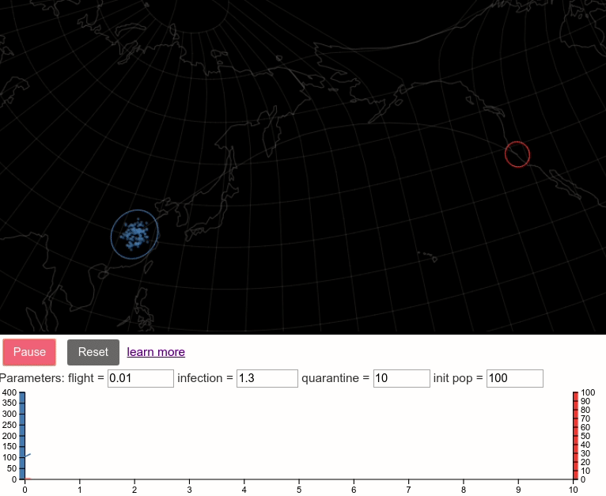

This model analyzes how the rate of travel between two cities could affect whether an epidemic in one city leads to an outbreak in the other.  It's a very simple nonlinear model that tries to estimate how much time there is after the start of an epidemic in one city to stop transportation from that city to another in order to prevent the spread from one to another.

[This pdf](https://github.com/lots-of-things/wuhan-virus-model/blob/master/Wuhan_to_SF_infection_model.pdf) contains a derivation of the model, the non-dimensionalization walkthrough, and some approximation of the critical time after which the infection will spread in the second city. [src](https://www.overleaf.com/read/yznysbcqxbhs)

I wrote the model to help understand how to develop [this interactive simulation](http://bl.ocks.org/stedn/b0acdeba81751c5f8e4ccaa74ccb09a9) of the spread from Wuhan to SF.  

